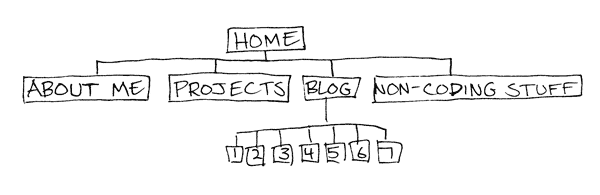

(Contact information will be in the footer of every page.)

**1. What are the 6 Phases of Web Design?**
1- Research. Defining the site's concept, purpose, goals, and target audience.
2- Planning. Determining how the site will be structured and implemented.
3- Design. Visual development of a mockup.
4- Development. Taking the prototype and building a functioning site.
5- Testing. Making sure everything works, the code validates, and the site displays properly on the target devices.
6- Maintenance. Updating contents, upgrading plugins, site backup.

**2. What is your site's primary goal or purpose? What kind of content will your site feature?**
My site's purpose is to advertise me to potential employers and partners. The goal is to present myself as creative and culturally savvy.Toward that end I'll feature a portfolio of projects (once we've made them), a collection of links to my Phase 0 blog, and a section showing some non-coding creative work.

**3. What is your target audience's interests and how do you see your site addressing them?**
My target audience is people who make creative entertainment. I'll address them by having the text be relatively sparse, creating a "design object" feel. Visuals and writing should create a direct, vibrant, fun tone.

**4. What is the primary "action" the user should take when coming to your site? Do you want them to search for information, contact you, or see your portfolio? It's ok to have several actions at once, or different actions for different kinds of visitors.**
I want the user to see the portfolio.

**5. What are the main things someone should know about design and user experience?**
They should know to consider the user experience in the first place. That usability and a clear site hierarchy are essential for getting and keeping viewers.

**6. What is user experience design and why is it valuable?**
UX is the study of how interfaces make a user feel. A site that is hard to navigate or use will lose viewers, and one that strikes the wrong tone won't appeal to the viewers you're targeting.

**7. Which parts of the challenge did you find tedious?**
Some of the reading materials seem written for client/business owners rather than for designers. The language was that businessy jargon about value-added deliverables and so on, which turns me off and made it harder to get through those articles than the ones aimed clearly at designers.