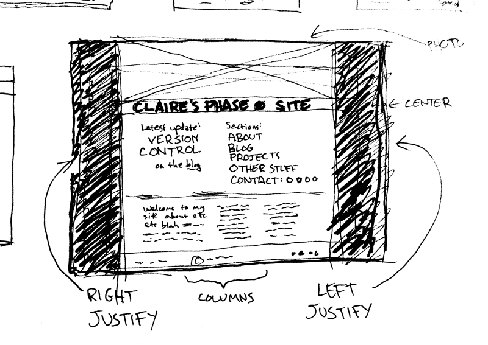

**•What is a wireframe?**
A wireframe is a mockup of the basic structure of a page, without graphics, colors, or styles. This is the first stage (or the preceding stage) of page design. Often the wireframe is presented to a client for approval before moving on to the next stage of refinement.

**•What are the benefits of wireframing?**
With a wireframe, you can see whether the layout of your page is readable, before you invest a lot of work on final polish. Also, stripping the design down to its basics helps you see the underlying structure better than if you were preoccupied with pretty graphics and typefaces. At its base, a webpage has to be functional, so it's good to lay it out at first in a design-agnostic way.

**•Did you enjoy wireframing your site?**
I had a bit of blank-page syndrome at first. But once I had a couple ideas down, I started trying out lots of different tweaks and variations, and ended up really getting into it. I think I "fell down the rabbit hole" on this one, even though we were warned against it.

**•Did you revise your wireframe or stick with your first idea?**
Revised. At first I had a modern kind of style in mind, but then I glanced over at a poster in my room--a blowup of a Tintin (a classic Belgian comic) cover from the 30s--and started thinking about Art Nouveau magazine and poster designs. This fit a lot better for the "creative" image I was going for, so I went with that instead.

**•What questions did you ask during this challenge? What resources did you find to help you answer them?**
I was trying to find a graceful and non-boxy way of laying out the page elements. I wanted the page to look more like a design object and less like a newspaper page. So I looked at a lot of Art Nouveau posters and covers to study how they positioned their text. A lot of the solutions wouldn't completely apply, since they had no body text to consider, but it got me thinking in some good directions.

**•Which parts of the challenge did you enjoy and which parts did you find tedious?**
I enjoyed thumbnailing and drawing the wireframes. Maybe too much; I wasn't able to rein myself in in terms of time. I guess, honestly, I get most stuck on these reflections. For me, writing quickly and writing succinctly are two opposing goals. I'm not sure how we're supposed to be writing these in only 10-15 minutes. But I understand the value of them.