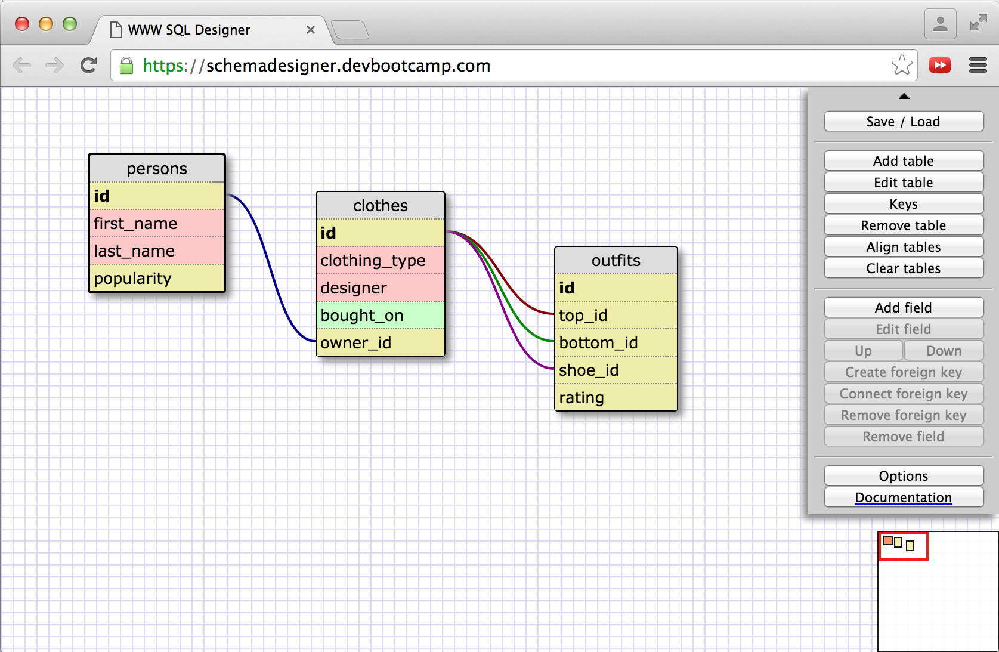

1. SELECT * from states
2. SELECT * FROM regions;
3. SELECT state_name, population FROM states;
4. SELECT state_name, population FROM states ORDER BY population DESC;
5. SELECT state_name from states WHERE region_id = 7;
6. SELECT state_name, population_density FROM states WHERE population_density > 50 ORDER BY population_density ASC;
7. SELECT state_name FROM states WHERE population > 1000000
AND population < 1500000;
8. SELECT state_name, region_id FROM states
   ...> ORDER BY region_id ASC;
9. SELECT region_name FROM regions
   ...> WHERE region_name LIKE '%Central%';
10. SELECT regions.region_name, states.state_name
   ...> FROM regions
   ...> JOIN states
   ...> ON regions.id = states.region_id
   ...> ORDER BY regions.id ASC;

-What are databases for?
Databases are for storing collections of categorized data that relate to one another.

-What is a one-to-many relationship?
A one-to-many relationship is one where an item on one side corresponds to more than one item on the other.

-What is a primary key? What is a foreign key? How can you determine which is which?
A primary key is a field that will contain a unique entry for each row. It is used as a unique identifier for that record. A foreign key is a field that refers to a primary key on another table, associating its contents with that record.

-How can you select information out of a SQL database? What are some general guidelines for that?

You can select information from a SQL database with the SELECT command and information about which data you want. You must tell it to SELECT a specific column FROM a specific table. E.g.:
SELECT movie_names FROM movies; => gives you the whole movie names column
But you can also make custom selections using wildcards, conditions, and joins.
SELECT * FROM movies; => gives you all info from movies
SELECT movie_name, year FROM movies WHERE genre == "scifi"; => gives you the name and year of all scifi movies
SELECT movies.movie_name, presidents.president_name
FROM movies
RIGHT JOIN presidents
ON movies.movie_name == presidents.favorite_movie;
=> gives you a list of movies and the presidents who picked them as their favorite