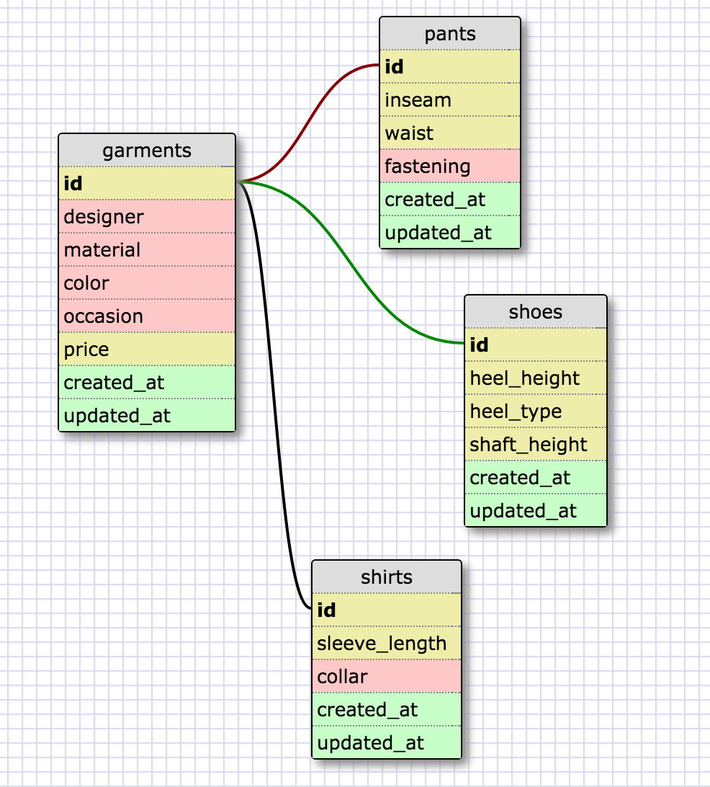

This is a one-to-one schema because each pair of records refers to the same item. They're just split into different tables because each type of clothing has different parameters. If the main table included fields for all those parameters, you'd have a lot of blank entries. For instance, inseam will be null for everything except pants, and collar will be null for everything except shirts. By containing the type-specific details in a separate table and linking it one-to-one with the main clothing table, we're saving all those null entries.

-What is a one-to-one database?

A one-to-one database is one composed of tables that have a one-to-one relationship to each other. That is, each corresponds to only its one counterpart and none other. For instance, a bunch of one-car garages could be described in a one-to-one database. There is only one car per garage and only one garage per car.

-When would you use a one-to-one database? (Think generally, not in terms of the example you created).

You could use a one-to-one database when the tables correspond uniquely, so technically they could be integrated into one table, but one of them contains information that's only relevent some of the time. For instance, if you're going to be looking up a couple fields very frequently, but there are a hundred other fields that you'll almost never need, you'll save resources by having them in another table so you won't have to call them up every time you want the regular data. Or, if there are fields that don't apply to every record and will be null for a large subset of the records, you could split off the records that do use those fields, and save on all those null fields.

-What is a many-to-many database?

In a many-to-many database, records in each table could relate to more than one record in the other table. For instance, an actor can be in many movies, and movies can have many actors in them.

-When would you use a many-to-many database? (Think generally, not in terms of the example you created).

You'd use a many-to-many database in a situation like the above, when describing relationships between two different things that each deal with a lot of other things instead of one thing.

-What is confusing about database schemas? What makes sense?
I find it confusing trying to keep the dimensions of the fields straight in my head, like what exactly each field refers to and how many things are in it, which makes it tricky to get straight the relations between different tables.